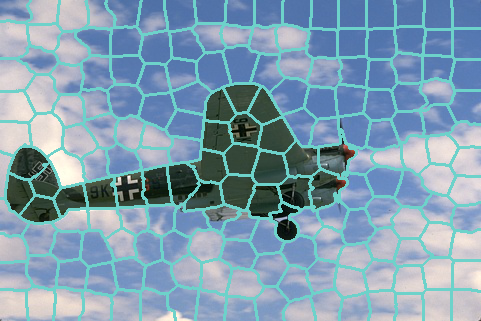

# SLIC Algorithm Implementation
The image oversegmentation by using superpixels is an efficient way to simplify it through pixel regions perceptually similar. SLIC (Simple Linear Iterative Clustering) it is an adaptation of the k-means algorithm to generate superpixels, was introduced by Achanta et al. (2010).

This implimentation use the PNG++ to read and write the images. For install this library see the 
[documentation](https://www.nongnu.org/pngpp/doc/0.2.9/).

### Run Code

Source files:
```bash
|-- Makefile
|-- src
    |-- colorspaces.cpp
    |-- slic.cpp
    |-- test_slic.cpp
```

Simply compile and run. There is a Makefile for a fast test.

#### C++
```
/* ------ Options: ---- */ 
{
  Usage: slic_cli image1 image2 [superpixels]
 -i <input_file> 
 -o <output_file> 
 -s <number_of_superpixels>
 }
```

#### Example
Sample using image 3063 taked from dataset [BSDS500](https://www2.eecs.berkeley.edu/Research/Projects/CS/vision/bsds/).
```
 ./bin/slic_cli -i sample/3063.png -o sample/3063_slic.png -s 200
```


